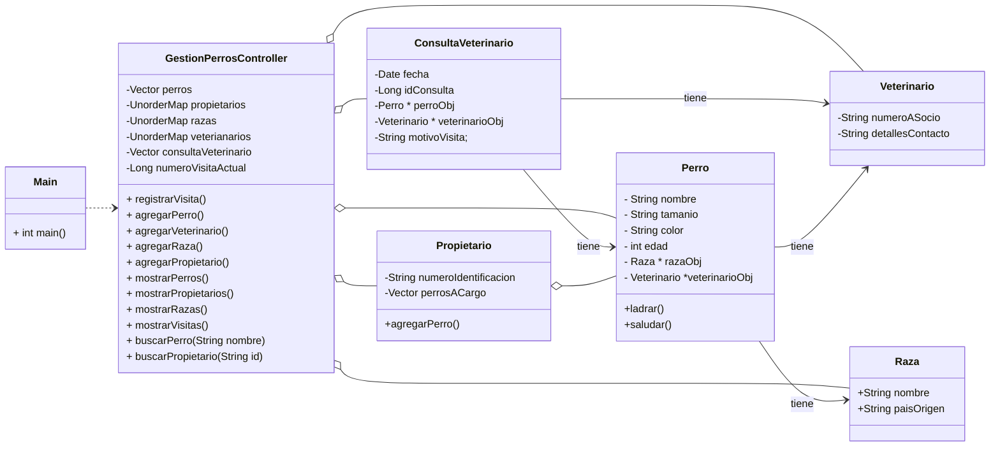

# 3.Ejercicio_POO
## Objetivo
* Implementar clases en C++ a partir de un diseño dado, siguiendo los principios de programación orientada a objetos de abstracción y encapsulación
* Utilizar Visual Studio Code para gestionar y depurar proyectos en C++ basados en un enunciado y diseño proporcionados.

## Requerimientos funcionales
Estás desarrollando una aplicación para gestionar la información de perros y sus propietarios. El sistema maneja información sobre perros, sus propietarios, razas y veterinarios.

La aplicación debe gestionar la información de los perros, cada uno con un nombre único, una edad, un tamaño (grande, mediano, pequeño) y un color. Los perros también tienen una raza asociada, que incluye el nombre de la raza y su país de origen.

Los propietarios son personas registradas en el sistema con un número de identificación único y una lista de perros a su cargo. Cada propietario puede tener varios perros bajo su cuidado.

Para la gestión de la salud de los perros, cada perro tiene un veterinario asignado. Los veterinarios son profesionales registrados en el sistema con un número de identificación único y detalles de contacto.

Además, debe ser posible registrar las visitas al veterinario, incluyendo el perro que fue atendido, el veterinario que lo atendió, la fecha de la visita y el motivo de la visita. Un perro puede tener múltiples visitas al veterinario a lo largo del tiempo, pero cada visita específica corresponde a un solo perro atendido por un solo veterinario en una fecha específica.

La aplicación permite realizar varias acciones importantes:

* Registrar visitas al veterinario, incluyendo el perro atendido, el veterinario que lo atendió, la fecha y el motivo de la visita.
* Agregar nuevos perros al sistema, proporcionando detalles como el nombre, la edad, el tamaño y el color del perro.
* Agregar nuevos veterinarios, incluyendo sus detalles de contacto.
* Agregar nuevas razas de perros, indicando el nombre de la raza y su país de origen.
* Mostrar la lista de todos los perros registrados en el sistema.
* Mostrar la lista de todos los propietarios registrados en el sistema.
* Mostrar la lista de todas las razas de perros registradas.
* Mostrar todas las visitas al veterinario registradas.
* Buscar perros por su nombre.

## Diseño propuesto

## Requerimientos no funcionales
* La compilación se realizará utilizando `CMake`
* Configurar el `formateador` de código
* Debe configurar `github actions` para hacer compilación automática del código cuando se despliegue

## Se espera
* Entregar un proyecto que codifique el diseño orientado a objetos propuesto, siguiendo el ejemplo de `Torres de Niza`[https://github.com/lufe089/clases_objetos_relaciones_ejemplo]
* Su proyecto debe tener menú para interactuar con las diferentes opciones
* Actualice el diagrama UML en caso de que haga alguna modificación

## Segunda versión
Corregir los `FIXME` y `TODO` que tiene el código. 
Gracias al equipo que prestó el código fuente de base :)